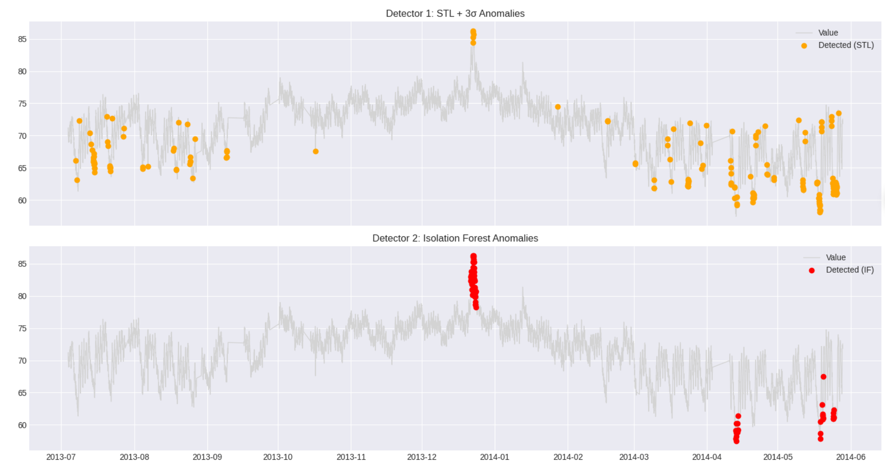

# W1-D1 Assignment: Metric Anomaly Detection

*Huỳnh Xuân Hậu*
*XB-DN26-129*

**Dataset:** `ambient_temperature_system_failure.csv` (Numenta Anomaly Benchmark)

## 1. Screenshots & Kết quả so sánh (Phase 2)

**Bảng so sánh hiệu năng 2 Detectors:**

| Detector | Precision | Recall | F1 Score | False Alarms |
| :--- | :--- | :--- | :--- | :--- |
| **STL + 3σ** | 0.005495 | 0.5 | 0.010870 | 181 |
| **Isolation Forest** | 0.027397 | 1.0 | 0.053333 | 71 |

---

## 2. Log Tuning Isolation Forest (Phase 3)
Quá trình tune tham số `contamination` trên Isolation Forest:

| Contamination | Precision | Recall | F1 Score |
| :--- | :--- | :--- | :--- |
| **0.01** | 0.027397 | 1.0 | 0.053333 |
| **0.02** | 0.013699 | 1.0 | 0.027027 |
| **0.05** | 0.005495 | 1.0 | 0.010929 |

**Kết luận tuning:** Tham số contamination = 0.01 cho kết quả F1 cao nhất (0.0533) và mô hình giữ được Recall 1.0 đồng thời tối thiểu hóa được số lượng cảnh báo giả so với các ngưỡng cao hơn. Model này đã được lưu thành `isolation_forest_model.pkl`.

---

## 3. Reflection & Đánh giá (Phase 3)

**1. Data thuộc loại gì?**
Qua quá trình phân tích EDA:
* Về phân phối: Dữ liệu tiệm cận phân phối chuẩn (Skewness = -0.39, |skew| < 0.5).
* Về tính mùa vụ: Trực quan biểu đồ ACF ở lag nhỏ cho thấy gợn sóng lặp lại đều đặn mỗi 24 bước. Do data có granularity là 1 hour/point, điều này phản ánh đúng tính mùa vụ chu kỳ 24h (nhiệt độ ngày/đêm).

**2. Phương pháp đã chọn & Lý do:**
* **Detector 1 (Thống kê):** Em chọn STL + 3σ (Period = 24) thay vì Rolling Z-Score thuần. Lý do là dữ liệu có chu kỳ ngày/đêm rõ ràng. Việc tách thành phần Seasonal ra trước giúp làm phẳng residual, từ đó 3σ sẽ bắt anomaly chính xác hơn.
* **Detector 2 (Machine Learning):** Dùng Isolation Forest. Thay vì đưa raw data vào, em đã tạo feature engineering (rolling_mean_1h, rolling_std_1h, rate_of_change, lag_1 với window=24) để model hiểu được bối cảnh (context) của time-series.

**3. Đánh giá Trade-off & Production Choice:**
* **Detector nào tốt hơn:** Dựa vào bảng số liệu, **Isolation Forest áp đảo hoàn toàn STL + 3σ**. IF đạt Recall tuyệt đối (1.0 so với 0.5 của STL), bắt được toàn bộ sự cố. Đồng thời, IF cũng có số lượng cảnh báo giả (False Alarms) thấp hơn hẳn (71 so với 181), dẫn đến F1 Score cao gấp 5 lần STL.
* **Trade-off:** Trong AIOps, Recall quan trọng hơn Precision (thà báo nhầm còn hơn bỏ sót sự cố gây outage). Tuy nhiên, nếu Recall cao mà False Alarm rate vọt lên hàng trăm thì sẽ gây "alert fatigue" cho On-call team.
* **Production Choice:** Mặc dù lý thuyết AIOps thường ưu tiên các thuật toán Thống kê làm First-pass vì tính đơn giản và tốc độ. Nhưng đối với tập dữ liệu cụ thể này, STL đang hoạt động quá kém (bỏ lọt 50% sự cố thật và spam 181 cảnh báo giả). Do đó, **em quyết định chọn Isolation Forest (contamination=0.01) để deploy lên Production**. Nó đảm bảo bắt được 100% anomaly với mức độ nhiễu (noise) có thể chấp nhận được.