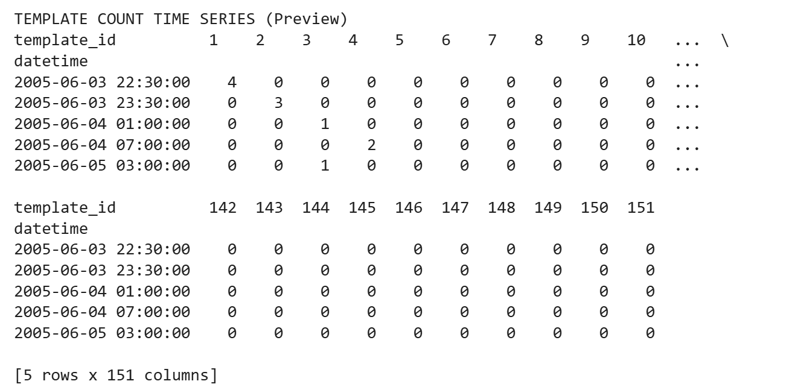
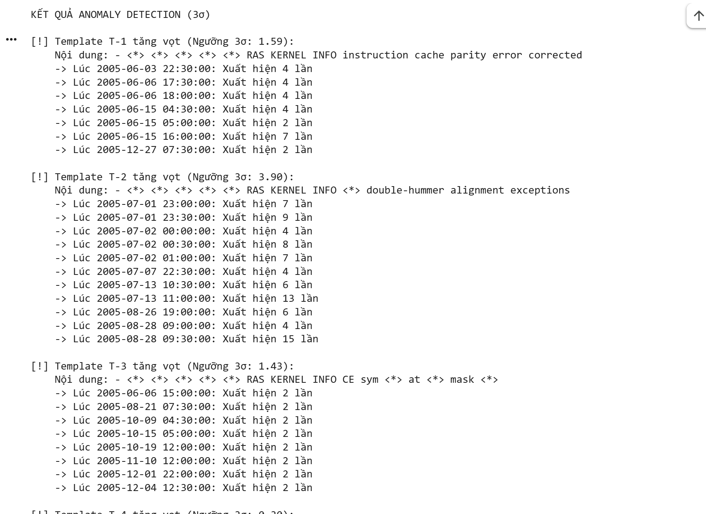
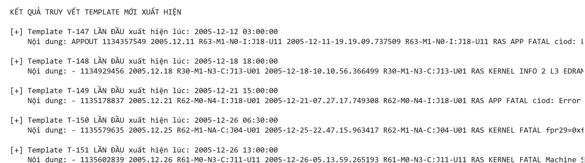

# Báo Cáo Bài Tập W1-D2: Log Mining + Parsing + Anomaly từ Log

## 1. Screenshots 

* **** Biểu đồ/Bảng Template Count Time Series (Ma trận đếm số lượng log theo từng khung giờ).
* **** Màn hình Terminal in ra kết quả Anomaly Highlighted (Phát hiện các template tăng vọt vượt ngưỡng 3-Sigma và truy vết thời gian xuất hiện của New Templates).

---

## 2. Kết quả Log Parsing (Drain3 Output)

### 2.1. Tuning Log (Thử nghiệm các giá trị sim_th)
Quá trình tinh chỉnh (tuning) tham số `drain_sim_th` trên tập dữ liệu `BGL_2k.log` cho kết quả như sau:
* `sim_th = 0.3` -> Tạo ra **73** templates.
* `sim_th = 0.5` -> Tạo ra **151** templates (Unique Clusters).
* `sim_th = 0.7` -> Tạo ra **1459** templates.

**=> Kết luận Tuning:** Em chọn `sim_th = 0.5`. 
*Lý do:* Ngưỡng 0.3 quá thấp khiến thuật toán gộp sai các lỗi có bản chất khác nhau thành một. Ngược lại, ngưỡng 0.7 quá cao khiến thuật toán quá "khó tính", không nhận diện được các parameter động (như hex code, node ID) và tách ra quá nhiều template vụn vặt, gây nhiễu dữ liệu. Mức 0.5 là điểm cân bằng lý tưởng nhất cho dataset này.

### 2.2. Kết quả Output Drain3 (Số template & Top 10)
* **Tổng số dòng log đã đọc:** 2,000 dòng.
* **Số lượng Template unique:** 151 templates.

**Top 10 Templates xuất hiện nhiều nhất:**
*(Lấy từ file top_templates.csv)*

| Rank | Template ID | Count | Nội dung Template (Template Mined) |
|---|---|---|---|
| 1 | **T-73** | **180** | **- <*> 2005.07.09 <*> <*> <*> RAS KERNEL INFO generating <*>** |
| 2 | **T-85** | **121** | **<*> <*> <*> <*> <*> RAS KERNEL INFO <*> floating point alignment exceptions** |
| 3 | **T-2** | **109** | **<*> <*> <*> <*> <*> RAS KERNEL INFO <*> double-hummer alignment exceptions** |
| 4 | **T-3** | **92** | **- <*> <*> <*> <*> <*> RAS KERNEL INFO CE sym <*> at <*> mask <*>** |
| 5 | **T-77** | **87** | **- <*> 2005.07.13 <*> <*> <*> RAS KERNEL INFO generating <*>** |
| 6 | **T-138** | **71** | **"- <*> 2005.12.01 <*> <*> <*> RAS KERNEL INFO <*> total interrupts. 0 critical input interrupts. 0 microseconds total spent on critical input interrupts, 0 microseconds max time in a critical input interrupt."** |
| 7 | **T-119** | **61** | **- <*> 2005.11.04 <*> <*> <*> RAS KERNEL INFO iar <*> dear <*>** |
| 8 | **T-14** | **60** | **KERNDTLB <*> 2005.06.11 R30-M0-N9-C:J16-U01 <*> R30-M0-N9-C:J16-U01 RAS KERNEL FATAL data TLB error interrupt** |
| 9 | **118** | **59** | **- <*> 2005.11.03 <*> <*> <*> RAS KERNEL INFO iar <*> dear <*>** |
| 10| **137** | **51** | **- <*> 2005.12.01 <*> <*> <*> RAS KERNEL INFO 0 microseconds spent in the rbs signal handler during 0 calls. 0 microseconds was the maximum time for a single instance of a correctable ddr.** |

---

## 3. Reflection (Cảm nhận & Đánh giá)

### 3.1. Drain3 parse có tốt không?
* **Đánh giá:** Drain3 hoạt động vô cùng hiệu quả và tốc độ.
* **Ưu điểm:** Khả năng tự động trừu tượng hóa cực kỳ thông minh. Thay vì phải cặm cụi viết Regex thủ công cho từng loại log, hệ thống tự động nhận diện các dữ liệu động (như địa chỉ IP, mã Hex `0x...`, Timestamp, Node ID) và thay thế bằng `<*>`. Điều này biến hàng ngàn dòng text lộn xộn thành các nhóm (cluster) sạch sẽ, giúp máy tính có thể đếm (Count) và dựng Time Series dễ dàng.

### 3.2. Template nào mang lại insight đắt giá?
Trong quá trình áp dụng 3-Sigma Anomaly Detection trên tập BGL, các template sau đã chỉ điểm chính xác tình trạng sức khỏe của hệ thống:
1. `RAS KERNEL FATAL data TLB error interrupt`: Khi template này spike, nó xác nhận nguyên nhân hệ thống chậm là do lỗi phần cứng vật lý do bộ nhớ đệm TLB chứ không phải do code phần mềm.
2. `INFO generating core.<*>`: Sự xuất hiện New Template báo hiệu ngay lập tức có một process vừa crash và hệ điều hành đang phải dump core bộ nhớ.
**=> Insight thu được:** Thay vì chỉ nhận được thông báo chung chung "hệ thống bị sập", việc phân tích Log Template chỉ thẳng đích danh **lỗi gì, do phần cứng hay phần mềm, và xảy ra ở Node nào**.

### 3.3. Sự khác biệt cốt lõi giữa Metric và Log?
* **Metric (Các chỉ số như CPU, RAM, Latency):** Trả lời câu hỏi **"Cái gì đang sai? Khi nào sai?"**. Nó giống như cái chuông báo cháy. Metric rú còi khi Latency tăng vọt lên 5s, nhưng nó không thể biết tại sao lại chậm.
* **Log:** Trả lời câu hỏi **"Tại sao lại sai? Bắt nguồn từ đâu?"**. Nó giống như camera an ninh. Nó ghi lại chính xác dòng code nào sinh ra lỗi, IP nào đang tấn công, hay Database nào vừa mất kết nối.
* **Sự kết hợp:** Phân tích độc lập từng cái sẽ rất tốn thời gian. Khi kết hợp lại, ta lấy thời điểm Metric rú còi làm mốc, sau đó khoanh vùng Log trong đúng thời điểm đó (± 5 phút) để tìm ra Template nào đang bị Spike. Đây là cách tìm ra Root Cause nhanh nhất và là tinh hoa thực sự của hệ thống AIOps.