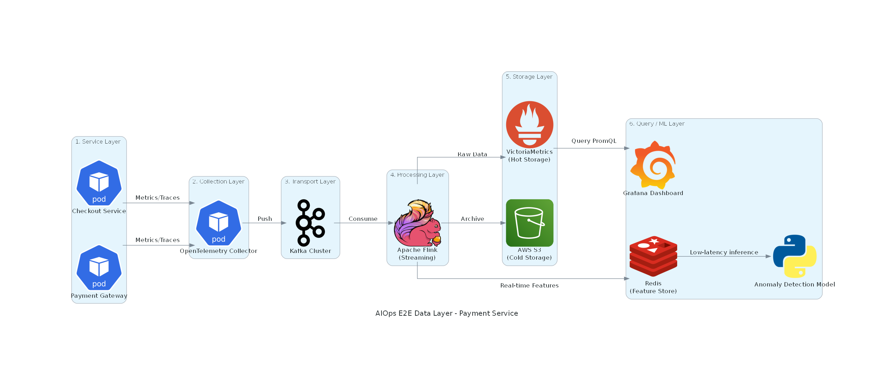

# Bài nộp Assignment W1-D3: Data Layer Architecture + Observability Pipeline
**Học viên:** Huỳnh Xuân Hậu
**Use Case:** Anomaly Detection trên Payment Service

---

## 1. Architecture Diagram
*(Bên dưới là ảnh chụp sơ đồ kiến trúc E2E Data Layer. Nếu ảnh bị lỗi, vui lòng xem chi tiết trong file `architecture.md`)*

 

**Tóm tắt Luồng Dữ Liệu:**
`[Payment Services]` -> `[OpenTelemetry Collector]` -> `[Apache Kafka]` -> `[Apache Flink]` -> `[VictoriaMetrics / S3]` -> `[Redis Feature Store / ML Pipeline / Grafana]`

---

## 2. Cost Estimate Table
Dưới đây là bảng ước tính chi phí hạ tầng và vận hành hàng tháng cho 3 cấp độ quy mô:

| Scale Tier   | Build: Storage ($)   | Build: Compute ($)   | Build: Network ($)   | Build: SRE Ops ($)   | Total BUILD ($/mo)   | Total BUY ($/mo)   | Recommendation    |
|:-------------|:---------------------|:---------------------|:---------------------|:---------------------|:---------------------|:-------------------|:------------------|
| Small        | $450                 | $2,500               | $50                  | $0                   | $3,000               | $9,750             | Build (Self-host) |
| Medium       | $4,500               | $25,000              | $500                 | $10,000              | $40,000              | $97,500            | Build (Self-host) |
| Large        | $45,000              | $250,000             | $5,000               | $25,000              | $325,000             | $975,000           | Build (Self-host) |

---

## 3. ADR Decision Summary
**ADR-001: Sử dụng Apache Kafka làm Transport Layer trung gian thay vì Direct Push.**

**Tóm tắt quyết định:** Để giải quyết rủi ro mất dữ liệu telemetry quan trọng trong các khung giờ cao điểm Flash Sale của hệ thống thanh toán, em quyết định chèn Apache Kafka vào giữa tầng Thu thập (OTel) và tầng Xử lý/Lưu trữ. Việc này giúp hệ thống có khả năng backpressure, đảm bảo "Zero Data Loss" và cho phép replay dữ liệu nếu database hạ nguồn gặp sự cố. Mặc dù phải đánh đổi bằng việc tăng chi phí hạ tầng (+$2,500/tháng) và độ phức tạp vận hành, nhưng sự an toàn dữ liệu cho Payment Service là ưu tiên tuyệt đối.

---

## 4. Reflection
**Tình huống:** Nếu được hire làm Platform Engineer cho startup 50-service vừa raise Series A, bạn sẽ recommend build hay buy? Tại sao?

**Khuyến nghị: BUY (Dùng SaaS như Datadog) kết hợp với Kiến trúc mở.**

**Lập luận chi tiết:**
Với tư cách là Platform Engineer của một startup vừa gọi vốn Series A với 50 services, mục tiêu tối thượng hiện tại là **Time-to-Market** (Tốc độ ra mắt tính năng) và **Chứng minh giá trị kinh doanh (Product-Market Fit)**. Do đó, em sẽ chọn "Mua" dựa trên các yếu tố sau:

1. **Chi phí cơ hội (Opportunity Cost):** Startup Series A cần dồn toàn lực kỹ sư vào việc phát triển Core Product. Việc "Tự xây" (Build) mất từ 3-6 tháng và đòi hỏi duy trì ít nhất 1-2 kỹ sư SRE giỏi. Chi phí tiền mặt tiết kiệm được khi Build không thể bù đắp lại số tiền đã "đốt" nếu sản phẩm ra mắt chậm trễ.
2. **Time to First Value:** SaaS (Datadog/New Relic) cung cấp giá trị ngay lập tức (1-2 tuần). Nó có sẵn dashboard, alerting AI, và APM profiling out-of-the-box mà không cần cấu hình phức tạp.
3. **Bài toán nhân sự:** Ở quy mô 50 services, việc vận hành Kafka, Flink hay Elasticsearch cluster ổn định cần kinh nghiệm cực sâu. Các startup thường khó tuyển ngay được SRE đủ tầm ở giai đoạn này.

**Tuy nhiên, em sẽ không "Buy" một cách mù quáng (Tránh Vendor Lock-in):**
Là người thiết kế hệ thống, em sẽ bắt buộc toàn bộ 50 services phải instrument code bằng **OpenTelemetry (OTel)** thay vì dùng thư viện độc quyền của vendor (VD: Datadog Agent). 
* **Tầm nhìn:** Trong 1-2 năm tới, khi công ty scale lên > 200 services và hóa đơn SaaS trở nên đắt đỏ không thể chịu nổi (như bảng dự toán Large Tier lên tới gần 1 triệu đô), em chỉ cần đổi endpoint của OTel Collector để trỏ dữ liệu về hệ thống tự dựng (Kafka/VictoriaMetrics). Bằng cách này, chúng ta có tốc độ của việc "Đi mua" ở hiện tại, nhưng giữ được sự độc lập để "Tự xây" trong tương lai mà không phải sửa lại code của 50 services.