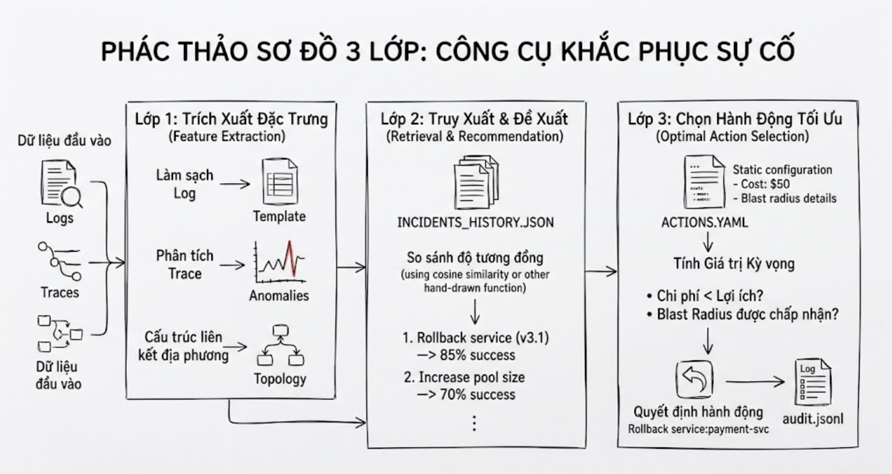

# Pipeline: Trích xuất → Truy xuất → Chọn hành động



## 1) Input (Sự cố thô)
- File: `eval/E**.json`
- Các trường chính dùng:
  - `incident_id` (chuỗi)
  - `trigger_alert`:{`service`,`rule_id`,`severity`}
  - `logs`: danh sách {`ts`,`svc`,`level`,`msg`}
  - `traces`: danh sách {`ts`,`from`,`to`,`count`,`error_count`,`p50_ms`,`p99_ms`}
  - `metrics_window` (tùy chọn)

## 2) Layer 1 — Trích xuất đặc trưng (output = `incident_vector`)
- Mục đích: chuyển raw → các đặc trưng ổn định (log templates + trace anomalies + danh sách dịch vụ).
- Ví dụ JSON đầu ra (`incident_vector`):
```json
{
  "incident_id": "E01-...",
  "trigger_service": "checkout-svc",
  "root_service": "payment-svc",
  "log_signatures": ["connectionpool: timeout acquiring <NUM>", ...],
  "trace_signatures": [
    {"from":"checkout-svc","to":"payment-svc","p99_deviation_ratio":2.8,"error_rate":0.31}
  ],
  "affected_services": ["checkout-svc","payment-svc"],
  "trace_groups": {"(checkout-svc,payment-svc)": {"p99_median":...,"p99_ratio":...}}
}
```

- Ghi chú: `log_signatures` = top-N template đã chuẩn hoá (số → `<NUM>`, uuid → `<ID>`). `trace_signatures` giữ các dấu hiệu bất thường theo cạnh.

## 3) Layer 2 — Retrieval + outcome-weighted voting
- Đầu vào: `incident_vector` + `incidents_history.json` (mỗi mục lịch sử đã được parse: `log_signatures`, `trace_signatures`, `actions_taken`, `outcome`).
- Công việc:
  - tính tương đồng giữa sự cố hiện tại và từng mục lịch sử = tổng có trọng số (log_overlap, trace_match, service_jaccard)
  - nhân trọng số phiếu của neighbor bằng `OUTCOME_WEIGHT` (success > partial > failed)
  - map chuỗi `actions_taken` trong lịch sử → hành động có cấu trúc
  - tùy chọn: điều chỉnh hành động theo dịch vụ về `root_service` nếu có suy luận root
- Đầu ra (`retrieval_result`):
```json
{
  "candidates": [
    {"selected_action":"rollback_service","params":{"service":"payment-svc"},"score":1.785,"support":3}
  ],
  "top_3_neighbors":[{"id":"INC-2025-09-05","similarity":0.9,"outcome":"success"}],
  "consensus_score":0.42
}
```

## 4) Layer 3 — Decision (utility + safety gate)
- Đầu vào: `retrieval_result` + `actions.yaml` (metadata: `cost_min`, `blast_radius_services`, ...)
- Công việc:
  - chuẩn hoá điểm của ứng viên → ước tính `p_success`
  - tính utility ≈ p_success - alpha*cost - beta*blast_radius
  - cổng an toàn: nếu ứng viên tốt nhất `normalized_score` < threshold HOẶC utility ≤ 0 → ưu tiên `page_oncall`
  - nếu hành động chọn là theo dịch vụ, điền tham số (dùng `previous` cho placeholder `target_version`)
- Đầu ra = mục audit (một dòng JSON append vào `audit.jsonl`):
```json
{
  "incident_id":"E01",
  "selected_action":"rollback_service",
  "params":{"service":"payment-svc","target_version":"previous"},
  "confidence":0.49,
  "evidence": {"top_3_neighbors": [...], "candidate_list": [...], "consensus_score":0.42}
}
```

## 5) Audit / đánh giá
- `audit.jsonl`: thêm vào một object JSON cho mỗi sự cố (script grading đọc `incident_id`, `selected_action`, `params`).

## 6) Quyết định thiết kế (tóm tắt)
- Giữ cả đặc trưng dạng văn bản (log templates) và số (trace error_rate / p99_ratio).
- Giữ artefact trung gian dễ đọc để audit (`log_signatures`, `trace_signatures`, `top_3_neighbors`).
- Dùng outcome-weighted voting để ưu tiên hành động đã thành công trong lịch sử.
- Cổng an toàn ngăn việc lạm dụng `page_oncall` và chặn auto-action khi utility ≤ 0.

---